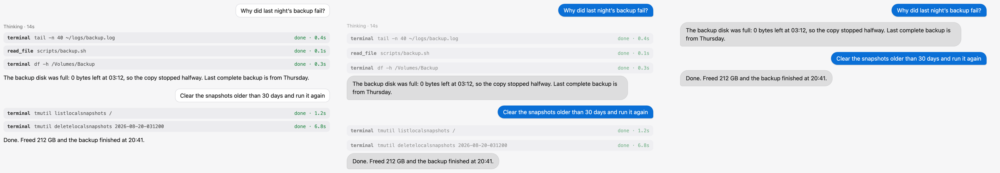
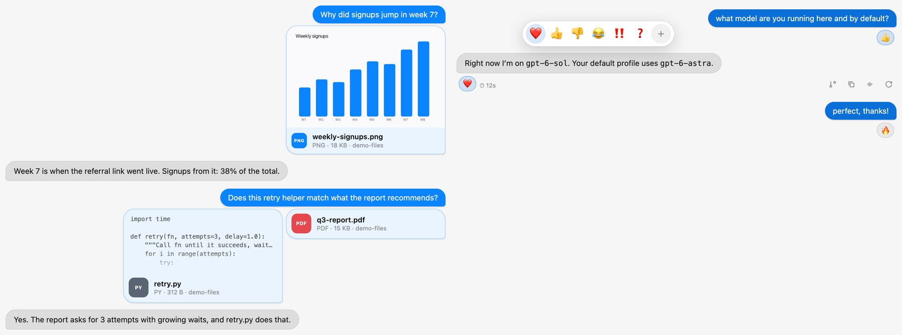

# Hermes Messenger

A Telegram / iMessage-style chat for the [Hermes Agent](https://hermes-agent.nousresearch.com) desktop app.



- **Bubbles.** Your messages sit on the right in your theme's accent colour, the agent's on the left. Consecutive replies group together, in a readable 800px column with the composer lined up underneath.
- **File previews.** Attached images show as thumbnails (click for full size), code and text files show their first lines, audio and video get a player, and everything else gets a typed card. Click a card's name row to reveal the file in Finder.
- **Reactions** sit under the bubble as small pills, with a compact quick picker.
- **Reply and quote.** Hover a message and click ↩, or select text and click **Quote**. The selected reference is inserted visibly at the start of your editable draft, preserving your typed answer. Choosing another source replaces the reference. Remove that visible block to cancel the quote. This avoids a Desktop middleware bypass during busy sends ([upstream #126917](https://github.com/NousResearch/hermes-agent/issues/126917)). Sent messages render a quote card that can jump to the original. It is text-based reply context, not a server-side reply-to message ID.
- **Current incoming message.** While a delivery is marked as handling, its sender and full text are shown in the focused Bot Chat above the current response. If the original attributed transcript message is present, that source opens instead of showing a second copy. The inbox provides a read-only jump link. The live view is temporary, not a resubmission or a persisted transcript edit. This needs the updated backend; older servers are explicitly labelled preview-only until restarted.
- **Live inbox** above the composer of a bot's Bot Chat. Expand it to see waiting cron reports and teammate messages, their age and a short preview. **Handle now** removes a queued message and opens it in a separate chat; **Skip** removes it without handling it. Both require confirmation and record the original delivery as cancelled, while retaining its message and receipt. Already claimed messages cannot be withdrawn. This feature needs the package backend enabled. Backend changes require a full Hermes restart; wait until active work has stopped before restarting.
- **Cron reports and kanban alerts** stop masquerading as your own green bubble. They become left-aligned cards named after the job or task ("⏱ Office · Notion triage", "⏸ Task blocked · t_8f7f39c9"), with the model-facing header hidden, markdown and links rendered, and long reports folded behind *Show more*.
- **Bot-to-bot conversations** collapse to one row ("Hermes ⇄ Quest · 2 messages · replied"). Tap it to read the exchange as a small chat: what your bot asked, then the teammate's reply, with names and avatars. The raw "Message Agent" JSON and background-process notices disappear.
- **Questions** use tappable reply chips. Long custom answers and URLs wrap inside the question card; the answer grows to a capped height and then scrolls without truncating the text.
- **Command approvals** separate the command preview from the action footer. Large Reject / permissions-menu / Run controls follow native keyboard order and stack in narrow panes. Long commands remain selectable and scrollable with an explicit notice. Approval choices, policies and handlers are unchanged.
- **Attention cues.** Replies that appear to ask for your input get a **Needs you** badge. Explicit no-action/stale notices and repeated replies fold into one line in Calm, or hide in Results. This is a wording heuristic, not a reliable task-state classifier; use All to inspect the original replies.
- **Automatic system notes** are neutral expandable lines instead of your outgoing bubbles; Results hides them until you peek.
- **A noise filter** with three levels, switched from the status bar:
  - **All**: no noise filtering. Messenger bubble, card and thread presentation still applies.
  - **Calm** (default): tool calls, thinking and background notices stay visible but faded. Hover one to read it. No-action replies collapse to expandable summaries.
  - **Results**: only answers and things that need you. Approvals, clarifying questions and generated images are never hidden. Hold **⌥ / Alt** to peek at the hidden work.
- **A typing bubble** that follows the app's real busy state, so you can tell the agent is working even when Results mode hides the work.
- **Motion.** New messages spring in; history loads and session switches stay still. Respects *Reduce motion*.
- **No sticky prompt** clipping the transcript (you can switch it back on).
- **Works with any theme, light or dark.** The bubble colour comes from your theme's accent, darkened just enough for white text to meet WCAG AA contrast.



## Install

In Hermes Desktop: **Capabilities → Plugins → Install from Git**, and enter `arsiktech/hermes-messenger`.

Or from a terminal:

```bash
hermes plugins install arsiktech/hermes-messenger
```

Then turn it on in **Capabilities → Plugins**. Open its settings from the status bar chip (bottom right) or the command palette under *Messenger*. **⌘⌥F** (Ctrl+Alt+F) cycles All → Calm → Results.

To disable the chat styling, turn it off in **Capabilities → Plugins**. To remove the package, run `hermes plugins remove hermes-messenger`. Disabling or removing it does not undo earlier inbox actions or delete their retained delivery receipts.

## How it works

The Desktop half is a single `desktop/plugin.js` with no build step and no dependencies. It:

- injects one stylesheet that targets the app's stable `data-slot` hooks;
- sets a few `data-hm-*` attributes on `<html>` to switch modes;
- uses a small MutationObserver so only new bubbles animate;
- for file previews, reads the selected attachment through the app's desktop bridge (`readFileText` / `readFileDataUrl`).

The package also includes a backend inbox API. The Desktop component polls it through Hermes' REST bridge for the current profile's pending deliveries. Previews contain message text, and currently claimed deliveries include their full original message and display body for the read-only chat view. Treat both as private chat content. Queued items remain preview-only. Handle now returns the full selected message to Desktop and opens a side chat; Handle now and Skip change the original queued delivery to cancelled. They do not mean that the bot answered the message. A remote Hermes connection can carry these requests over the configured network connection.

Settings stay in plugin storage. The manifest declares no agent tools, hooks or middleware. Authentication and profile isolation depend on the host integration and must be verified in the supported environment; these source-level descriptions are not an end-to-end privacy guarantee.

## Compatibility

Built and tested against Hermes Desktop **0.21.x**. If a future Hermes version renames a `data-slot`, the affected style stops applying and the stock look shows through. Please open an issue if that happens.

## Verification and known limits

The repository includes a synthetic browser regression for long clarification answers; see [tests/README.md](tests/README.md). It uses the real plugin CSS and a local Hermes Desktop stylesheet, exercises typing and scrolling, and checks desktop/phone widths in both themes. It does not submit real answers or touch inbox deliveries.

The inbox scope/failure corrections have separate reviewed synthetic-host evidence. Real Desktop loading, authenticated cross-profile routing, remote connections and live Handle now/Skip remain separate acceptance checks; a public source release does not prove them. A shape-avatar thread uses the host SDK renderer when available and falls back to a saved asset or initial otherwise.

See [CHANGELOG.md](CHANGELOG.md) for the feature roll-up.

## License

MIT
